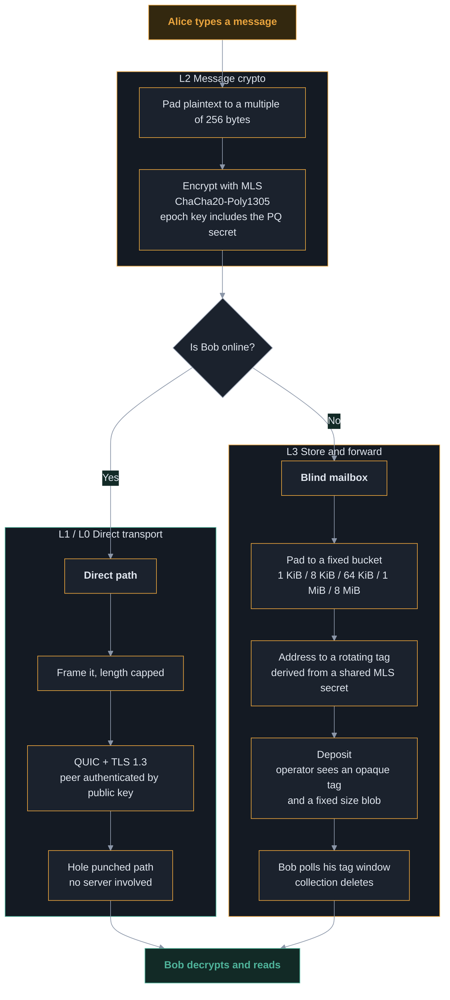
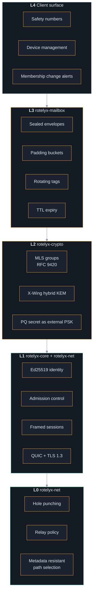
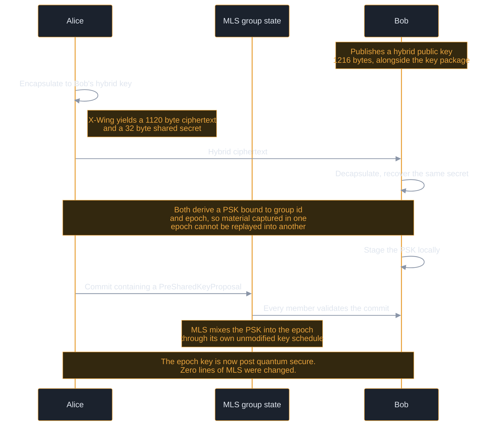
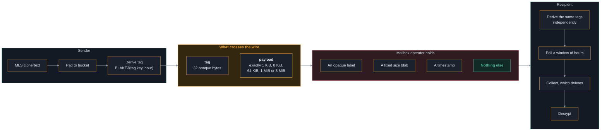
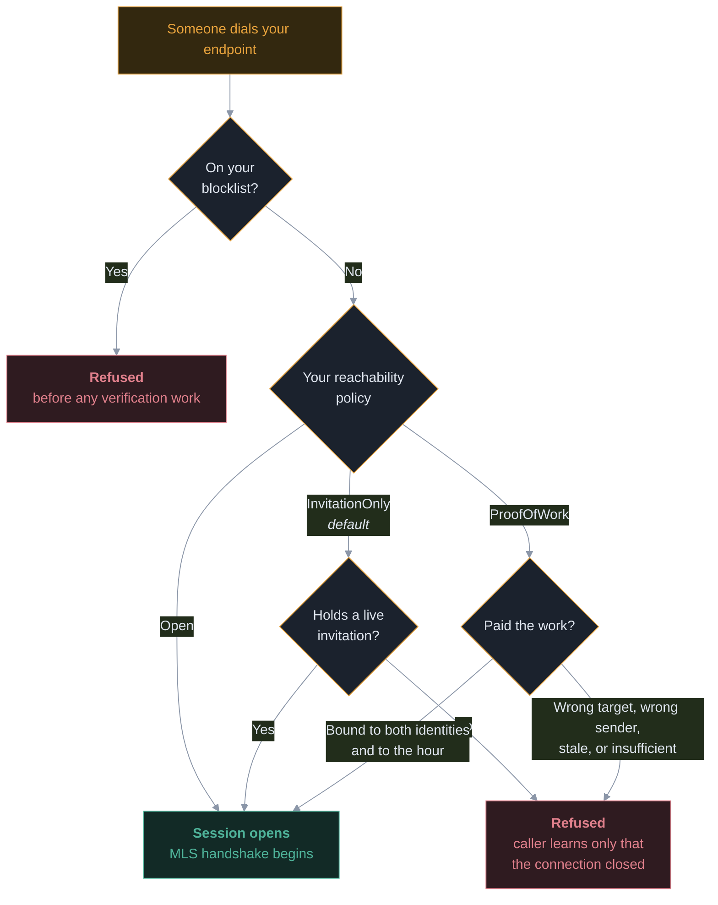
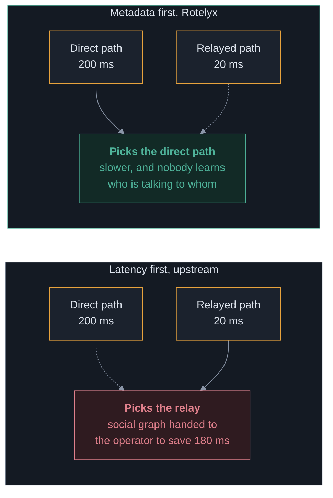
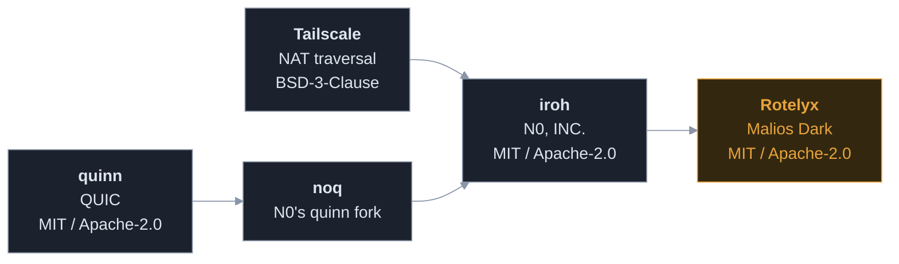

<div align="center">

<picture>
  <source media="(prefers-color-scheme: dark)" srcset="docs/brand/rotelyx-logo-dark.png">
  <source media="(prefers-color-scheme: light)" srcset="docs/brand/rotelyx-logo-light.png">
  
</picture>

**Peer to peer end to end encrypted messaging on a transport that lives in this repository.**

Identity is an Ed25519 key. No phone number, no email, no account, no directory.

[](#testing)
[](#running-it)
[](#licence)
[](#security-status)


</div>

---

> [!CAUTION]
> **Rotelyx is unaudited and pre release. Do not use it to protect anything.**
> It makes no security claims until the review gates in
> [`docs/THREAT-MODEL.md`](docs/THREAT-MODEL.md) section 5 are met.

---

## Table of contents

- [What Rotelyx is](#what-rotelyx-is)
- [The name](#the-name)
- [How a message travels](#how-a-message-travels)
- [Architecture](#architecture)
- [What each layer guarantees](#what-each-layer-guarantees)
- [Post quantum protection](#post-quantum-protection)
- [The blind mailbox](#the-blind-mailbox)
- [Reachability and abuse resistance](#reachability-and-abuse-resistance)
- [Path selection](#path-selection)
- [Contacting no third party infrastructure](#contacting-no-third-party-infrastructure)
- [Threat model summary](#threat-model-summary)
- [Comparison](#comparison)
- [Running it](#running-it)
- [Browser harness](#browser-harness)
- [Running your own relay](#running-your-own-relay)
- [Repository layout](#repository-layout)
- [Testing](#testing)
- [Provenance and licences](#provenance-and-licences)
- [Deployment](#deployment)
- [Roadmap](#roadmap)
- [Security status](#security-status)
- [Licence](#licence)

---

## What Rotelyx is

When both peers are online, messages travel **directly between devices** over
QUIC and touch no server at all. When a peer is offline, a sealed and padded
envelope is left in a **blind mailbox** that never learns the sender, never sees
plaintext, and that anyone can self host.

Three properties define the design:

| Property | How it is achieved |
|---|---|
| **No identity registry** | An identity is an Ed25519 keypair. Addresses are exchanged out of band. Nothing is published anywhere. |
| **Two independent encryption layers** | QUIC + TLS 1.3 at the transport, MLS at the message layer. No key material crosses between them, so breaking one does not break the other. |
| **Post quantum from day one** | X-Wing (ML-KEM-768 + X25519) injected into the MLS key schedule as an external pre shared key. |

### What Rotelyx deliberately is not

It is **not a mixnet**. It provides confidentiality and metadata minimisation,
not anonymity against an adversary watching the whole network. It does **not**
protect a compromised device. It does **not** claim deniability. Those
boundaries are written down in the threat model rather than glossed over,
because a threat model that only lists solved problems is marketing.

---

## The name

Rotelyx is built from the protocol itself:

```
ROT  --->  Rotating tags        mailbox addresses that rotate hourly and are unlinkable
E    --->  sealed Envelope      no sender field, no recipient identity, no plaintext length
LY   --->  LaYered encryption   two independent cryptographic layers
X    --->  X-Wing               the hybrid ML-KEM-768 + X25519 KEM
```

Every element is a component that actually exists in the code, not a marketing
gloss applied afterwards.

---

## How a message travels

The full path of a single message, from typing to reading.



**The direct path involves no server whatsoever.** The mailbox exists only for
the case where the recipient is not there, which on phones is most of the time.

---

## Architecture

Five layers. The two encryption layers are independent by construction.



### Why two independent layers

If TLS 1.3 inside QUIC were broken tomorrow, L2 would still hold. If a device
leaked an MLS epoch key, L1 and L0 would still deny an eavesdropper the raw
stream. **No key material is derived from one layer into the other.** That
separation is a design rule, not an accident.

---

## What each layer guarantees

| Layer | Crate | Guarantees | Does not guarantee |
|---|---|---|---|
| **L3** | `rotelyx-mailbox` | Operator sees no sender, no recipient identity, no plaintext, no message length | Timing correlation between deposit and collection. Deletion is enforced by code, not by protocol |
| **L2** | `rotelyx-crypto` | Forward secrecy, post compromise security, membership visible in commits, post quantum epoch keys | Anything once a device is compromised |
| **L1** | `rotelyx-core` | Peer authenticated by public key, admission control before any group crypto, length capped framing | That the key belongs to the person you mean. That is what safety numbers are for |
| **L0** | `rotelyx-net` | Direct paths preferred over relayed ones at any latency, no third party infrastructure contacted | That a direct path always exists. Roughly 10 to 20 percent of NAT pairs cannot be punched |

---

## Post quantum protection

### The problem

RFC 9420 defines only classical ciphersuites. The post quantum suites are still
in draft. A conversation recorded today can be decrypted later by an adversary
with a quantum computer, which is the harvest now decrypt later attack.

### What Rotelyx does

It does **not** invent a KEM combiner. It uses
[X-Wing](https://datatracker.ietf.org/doc/html/draft-connolly-cfrg-xwing-kem-10),
which is published, peer reviewed and deployed. Its security claim:

> The shared secret is secure if SHA3 is secure **and** *either* X25519 **or**
> ML-KEM-768 is secure.

Both would have to break at once.



### Why the pre shared key input rather than a fork

Two properties fall out of using the mechanism MLS already defines:

1. **Material refreshes per epoch** instead of being fixed at group creation.
2. **No member can inject a chosen PSK silently.** The proposal is part of the
   commit that every member validates, which is the same property that makes a
   ghost member addition visible.

> [!IMPORTANT]
> This composition is the **single novel cryptographic construction** in
> Rotelyx. It is roughly forty lines. It is small on purpose, and it is the
> specific item that must be independently reviewed before any release.

---

## The blind mailbox

### What the operator sees

Exactly two things: an opaque 32 byte tag, and a payload whose length is one of
five fixed values.



### Three design decisions worth explaining

**No length prefix is written.** The padding is trailing zeroes, and the
recipient recovers the real content because the inner MLS message is self
delimiting. Writing a length field would have been the natural thing to do and
would have handed the operator exactly the information the buckets exist to
hide.

**Addressing is never transmitted.** Both sides derive the tag key from the MLS
exporter secret. Nothing about where a message is addressed travels over the
network.

**Collection is destructive.** An envelope handed over is gone. A client that
crashes mid collection loses those messages. The alternative is a mailbox that
keeps copies, which is exactly what this is trying not to be.

### What the mailbox does not solve

An operator can retain envelopes past their TTL and correlate deposits with
collections by timing. **Deletion is a promise this code makes, not one the
protocol enforces.** The mitigation is not technical: the mailbox is a single
self hostable binary, so seizing one operator compromises one community rather
than a population.

---

## Reachability and abuse resistance

Free identities mean free spam. This is the property that removes phone numbers
from the design and the same property that made Kik a haven for unsolicited
contact. Cryptography does not fix it. Scarcity does.



### Why the proof of work is non transferable

The work binds to the sender, the recipient **and** the hour:

| Binding | What it prevents |
|---|---|
| **Recipient** | Work spent reaching one person cannot be reused on another. A bulk sender pays per recipient. |
| **Sender** | A spammer cannot solve once and reuse it across a fleet of throwaway identities. Each identity pays again. |
| **Hour** | Proofs cannot be stockpiled in advance, and they expire on their own. |

Together those force a choice: **reuse one identity and be blocked, or pay the
work for every new one.** That destroys the economics of bulk contact, which is
the actual threat. It does not stop a determined individual, and it is not meant
to.

### Revocation is surgical

Revoking a leaked invitation does not shut out holders of the others. Expiry is
a promise about the future. A leak is a problem right now.

---

## Path selection

The transport this is derived from selects network paths by latency. Rotelyx
selects by **metadata resistance**, and the two objectives genuinely conflict.



Three policies are available:

| Policy | Behaviour |
|---|---|
| `PreferDirect` **(default)** | Any direct path beats any relayed path at any latency. Falls back to a relay only when no direct path exists. |
| `DirectOnceAvailable` | As above, and never returns to a relay once direct. If the direct path dies, the connection dies. |
| `Fastest` | Upstream's objective. Provided so the privacy preserving policies have something to be measured against. |

**The cost is real latency, sometimes.** A direct path across the world can be
slower than a relay two hops away, and Rotelyx will take the slow one.

---

## Contacting no third party infrastructure

This is a hard requirement, enforced **structurally** rather than by
configuration:

- `RelayPolicy` has **no variant** meaning "the library's defaults"
- `AddressLookup` has **no variant** that publishes anywhere
- `NetConfig` has **no `Default` implementation**
- Peer discovery code is **deleted from the tree**, not disabled

A wrong configuration value is a bug you find in production. A missing
constructor is a bug you find at compile time.

### Enforced by test

`crates/rotelyx-net/tests/no_foreign_infrastructure.rs` binds live endpoints,
reads back the relay maps they actually hold, scans the whole workspace for
third party hostnames, and asserts that upstream environment overrides have no
effect. **If any of that stops holding, the build fails.**

Two rules, and the difference between them matters:

1. A foreign hostname **inside a Rust string literal** is always a failure. No
   exception mechanism exists, because a string literal is the shape of
   something the program can connect to.
2. Anywhere else, comments and manifests included, the occurrence must appear in
   `foreign-names-reviewed.txt` with a reason. Author attribution and
   documentation links are legitimate, and they are also exactly where a real
   endpoint could sit waiting to be uncommented.

The earlier version of this guard skipped comments and never looked at
manifests. It was then defeated by the project's own rebranding: a rename
rewrote `iroh` inside string literals, so `use1-1.relay.n0.iroh.link` became
`use1-1.relay.n0.rotelyx_transport.link` and stopped matching any token the
guard knew. The constants survived by being renamed. **A guard that matches on a
brand name is defeated by changing the brand name.**

---

## Threat model summary

Ten adversaries are modelled in [`docs/THREAT-MODEL.md`](docs/THREAT-MODEL.md).
The honest summary:

| Adversary | Defended | Notes |
|---|---|---|
| Passive network observer | Content, group membership | Flow existence is visible |
| Active network attacker | Content, membership, replay | Cannot deny denial of service |
| Relay operator | Content | **Sees which endpoint talks to which.** Inherent to relayed transport |
| Mailbox operator | Content, sender identity, message length | Timing correlation, and retention past TTL |
| Server seizure | Everything retroactively | No plaintext or keys exist on any server |
| **Compromised endpoint** | **Nothing** | The honest boundary of the entire system |
| Malicious group member | Silent additions are visible | A participant can always record and republish |
| **Global passive adversary** | **Nothing** | Rotelyx is not a mixnet. Such users need Tor |
| Push notification provider | Content | Sees that a device was woken, and when |
| Spam and abuse | Bulk contact economics | Not a determined individual attacker |

---

## Comparison

| Property | Telegram | Signal | Rotelyx |
|---|---|---|---|
| End to end encryption by default | No, secret chats only | Yes | Yes, no other mode exists |
| Group end to end encryption | None | Sender keys over Double Ratchet | MLS tree, O(log n) rekey |
| Identity | Phone number | Phone number | Ed25519 key, no personal data |
| Transport | To central servers | To central servers | Direct peer to peer, blind relay fallback |
| Post quantum | No | Yes | Yes, hybrid X-Wing |
| Self hostable | No | Not practically | Relay and mailbox both |
| Message length hidden | No | Partially | Yes, plaintext padded and envelopes bucketed |
| **Independent audit** | Protocol criticised repeatedly | **Repeatedly audited** | **None yet** |

That last row is the difference between a strong design and a trustworthy
product, and no amount of architecture closes it.

---

## Running it

Requires Rust 1.85 or newer.

```sh
cargo build -p rotelyx-cli
R=./target/debug/rotelyx-cli
```

### Terminal 1, issue an invitation and wait

```sh
$R --identity alice.key invite --hours 24
#   7otIsVn_jAFHYFb1Yp62rDxm5spaU75eM5MoDSHosgo

$R --identity alice.key listen
#   listening as 660daca6...
#   rotelyx connect 'eyJpZCI6...'
```

### Terminal 2, connect with both the address and the invitation

```sh
$R --identity bob.key connect 'eyJpZCI6...' \
   --invite 7otIsVn_jAFHYFb1Yp62rDxm5spaU75eM5MoDSHosgo
```

Both sides print a safety number:

```
peer          2af65b693779a3163f0519ac0cced6bd208cd09ee8de796dba0999edbbaabb92
safety number 41908 75433 94850 77313 01440 94499 53654 59718 70563 59440 56977 54559
```

> [!TIP]
> **Compare those digits out loud before trusting the session.** The transport
> authenticated a key, not a person. If they differ, someone is in the middle.

### Two behaviours that are deliberate

**`listen` refuses to start without a live invitation.** An identity is
unreachable by default. `--open` exists and has to be typed.

**A refused caller sees only that the connection closed.** A detailed reason
would turn every identity into an oracle for its own reachability policy.

---

## Desktop app

A native window over the same stack: real QUIC, real MLS, real admission
control, sealed identity on disk. No Node and no bundler, because the frontend
is plain HTML.

```sh
cargo build -p rotelyx-desktop
./scripts/rotelyx-desktop
```

Build prerequisites on Debian or Ubuntu:

```sh
sudo apt install -y libwebkit2gtk-4.1-dev build-essential curl wget file \
  libxdo-dev libssl-dev libayatana-appindicator3-dev librsvg2-dev \
  libasound2-dev cmake
```

To run two of them side by side, point each at its own identity:

```sh
ROTELYX_IDENTITY=alice.key ./scripts/rotelyx-desktop &
ROTELYX_IDENTITY=bob.key   ./scripts/rotelyx-desktop &
```

> [!NOTE]
> **Tauri IPC is in process, so plaintext never crosses a socket.** This is the
> meaningful difference from the browser harness below, which speaks over
> loopback and therefore admits anything on the machine that can reach that
> port. What remains outside the boundary is the operating system and anything
> with code execution on the device, which is unavoidable in any client that
> draws a message on a screen.

`scripts/rotelyx-desktop` clears snap runtime variables before launching. A
terminal started from inside a snap, VS Code's for example, leaks its own
library paths and a normally linked binary then dies on the snap's libpthread.
The wrapper changes nothing about Rotelyx, it only stops a foreign runtime
being injected underneath it.

## Browser harness

For clicking rather than typing. No Node, no bundler, no CDN: one Rust binary
serving one self contained page.

```sh
cargo build -p rotelyx-web

./target/debug/rotelyx-web --identity alice.key --bind 127.0.0.1:8081
./target/debug/rotelyx-web --identity bob.key   --bind 127.0.0.1:8082
```

Open both tabs, issue an invitation in the first, press **Listen**, then paste
its address and invitation into the second and press **Connect**.

The page shows the safety number and whether the session is on a **direct path**
or **relayed**.

> [!WARNING]
> **The browser is outside the encryption boundary.** Plaintext travels from the
> page to the local process over loopback, and encryption happens in the
> process. Acceptable for a harness, unacceptable for a product, where the
> crypto belongs in the same trust domain as the display.

---

## Running your own relay

A relay exists for one case: two peers that cannot hole punch through their
NATs. It forwards QUIC ciphertext and holds no keys.

```sh
cargo build -p rotelyx-relay

rotelyx-cli --identity alice.key id >> community.allow

./target/debug/rotelyx-relay --bind 0.0.0.0:3340 --allow community.allow
```

### Two refusals that matter

It refuses to start **without an explicit policy**, and refuses to start on an
**empty allowlist** rather than falling open. A relay that silently serves the
whole internet is the failure nobody notices, because it works perfectly.

> [!IMPORTANT]
> **A relay learns which endpoint talks to which, and when.** That is the social
> graph. It is inherent to relayed transport and no configuration removes it.
> Run your own so that pairing is visible to you rather than to a stranger.

No metrics endpoint is exposed. Telemetry in a privacy tool is an operational
record of who connected and when, sitting in a second place with weaker access
control than the relay itself.

---

## Repository layout

```
crates/
  rotelyx-net       L0/L1  transport, relay policy, path policy
                           NOTICE, VENDORING.md, LICENSE-{MIT,APACHE,BSD3}
  rotelyx-core      L1     identity, admission control, safety numbers, framing
  rotelyx-crypto    L2     MLS integration and the hybrid PQ composition
  rotelyx-mailbox   L3     blind store and forward, self hostable
  rotelyx-cli              two terminal chat, for running the protocol
  rotelyx-relay            the relay server binary
  rotelyx-desktop          native desktop window, Tauri v2, no Node
  rotelyx-web              local browser harness
  net/                     the vendored transport stack, 121,197 lines
docs/
  brand/                       logo, light and dark variants, and the square mark
  DEPLOYMENT.md                what is deployed, where, and why each choice was made
  THREAT-MODEL.md              what Rotelyx defends against, and what it does not
  PQ-COMPOSITION.md            the novel construction, specified for review
  rotelyx-architecture.html    the architecture assessment
TODO.md                        what is done, what is next, what is blocked
```

---

## Building and memory

The vendored transport is 121,000 lines and includes a 50,000 line QUIC state
machine. Cargo defaults to one compile job per core, and on a machine with a
small swap file that peak is enough to make the kernel start killing processes.
An editor is a large, easy target.

`.cargo/config.toml` in this repository caps the build at four jobs for that
reason. Raise it if you have RAM headroom:

```sh
cargo build --workspace -j 8
```

If builds still stall the machine, more swap helps more than fewer jobs:

```sh
sudo fallocate -l 8G /swapfile2 && sudo chmod 600 /swapfile2
sudo mkswap /swapfile2 && sudo swapon /swapfile2
```

## Testing

```sh
cargo test --workspace
```

**158 tests.** The distribution matters more than the count:

| Suite | Tests | What it proves |
|---|---:|---|
| `rotelyx-core` | 59 + 5 | Identity, sealed storage, framing, admission control **over real sockets** |
| `rotelyx-crypto` | 23 | MLS conversations, X-Wing, the PQ secret reaching the key schedule |
| `rotelyx-mailbox` | 23 | Envelopes, buckets, tag rotation, TTL expiry |
| `rotelyx-net` | 13 + 5 + 3 | Path policy, the zero foreign infrastructure guard, **live QUIC connections** |
| `rotelyx-cli` | 6 + 6 | Key file sealing and migration, plus cross layer: a message surviving the whole offline path |
| `rotelyx-relay` | 4 | Allowlist behaviour, including refusing to fall open |

### Three defects found by testing, not by review

Every unit test passed while these were live. Only cross layer tests and tests
over real sockets found them:

1. **MLS was not padding at all.** Overhead is a constant 145 bytes and the rest
   is one to one, so plaintext length leaked exactly. Worst on the direct path,
   where there is no envelope to hide behind.
2. **Padding buckets were too small.** A 256 byte bucket held barely a hundred
   characters after MLS overhead, so ordinary messages straddled the boundary
   and told the operator "short" or "long" every time.
3. **Dropped QUIC streams discarded data.** A send stream dropped without
   finishing resets and silently discards data the sender believes was
   delivered. Write then drop is the obvious pattern, and it lost the last
   message with no error anywhere.

---

## Provenance and licences

Rotelyx's transport is **derived from [iroh](https://github.com/n0-computer/iroh)**
and vendored into this repository. No upstream networking package is downloaded.

The lineage is worth stating plainly:



**Nobody in this lineage wrote NAT traversal from zero.** Tailscale did the
original work, N0 derived from it, Rotelyx derives from that. Building on it is
the normal case, not the exception.

### The defensible claim

> Rotelyx ships its own transport, derived from iroh and substantially rewritten
> for metadata resistance.

### The indefensible one

> We wrote a transport library from scratch.

Do not make it. Full provenance, licence obligations and the per subsystem
replacement plan are in
[`crates/rotelyx-net/VENDORING.md`](crates/rotelyx-net/VENDORING.md) and
[`crates/rotelyx-net/NOTICE`](crates/rotelyx-net/NOTICE). Those notices are a
licence obligation and must not be removed.

---

## Deployment

Hosts, nginx configuration, firewall rules and verification commands are in
[`docs/DEPLOYMENT.md`](docs/DEPLOYMENT.md).

## Roadmap

Full status in [`TODO.md`](TODO.md). The short version:

**Done.** Transport vendored and renamed, zero foreign infrastructure with a
build breaking guard, MLS conversations, hybrid post quantum key agreement
reaching the MLS key schedule, blind mailbox, admission control enforced on the
accept path, metadata resistant path selection, relay server, CLI and browser
harnesses.

**Next.** Field test across two real NATs, published test vectors for the PQ
composition, audio calls, mobile clients.

**Blocking any public security claim.** An independent cryptographic audit.

---

## Security status

Rotelyx makes **no claim** of being unbreakable, un interceptable or impossible
to access. Those claims are false for every system that has ever made them.

What it claims is bounded, written down and testable. See
[`docs/THREAT-MODEL.md`](docs/THREAT-MODEL.md).

---

## Licence

MIT OR Apache-2.0, at your option. Portions derived from third party work under
MIT, Apache-2.0 and BSD-3-Clause. See
[`crates/rotelyx-net/NOTICE`](crates/rotelyx-net/NOTICE).

<div align="center">


</div>
