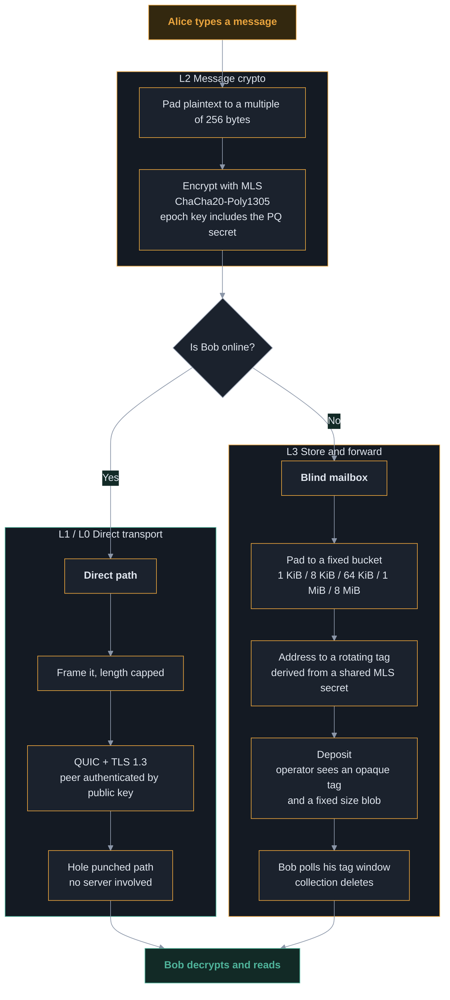
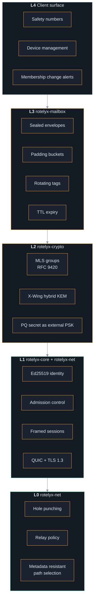
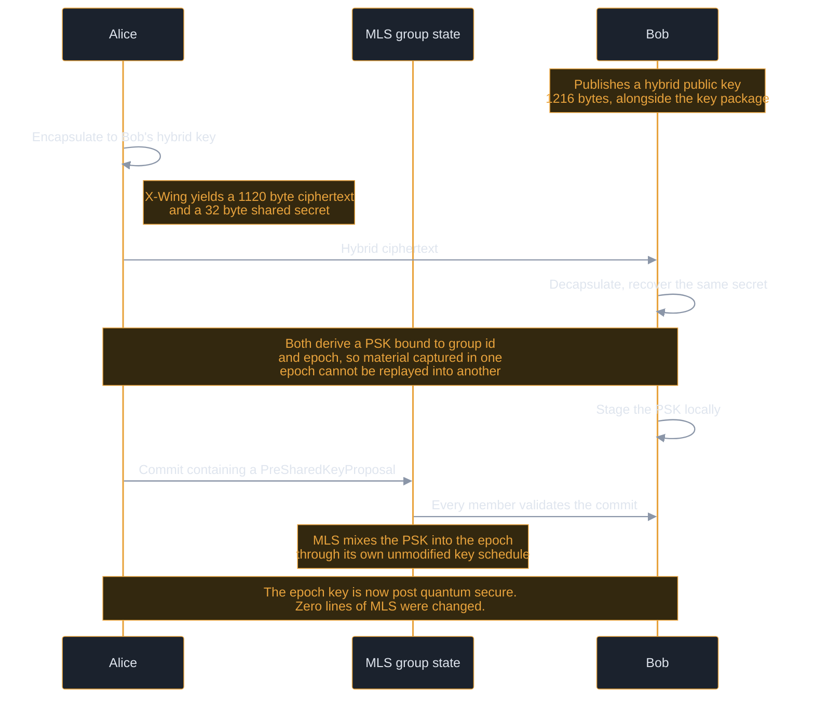
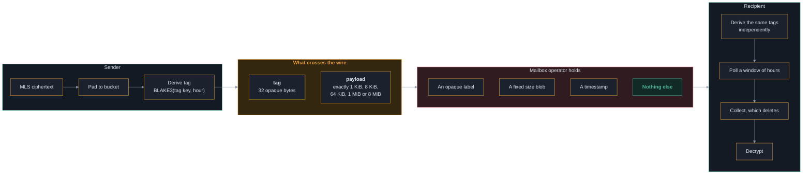
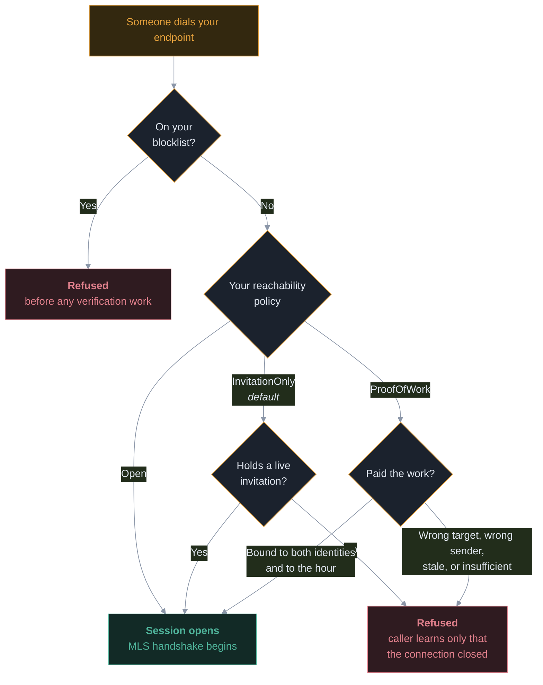
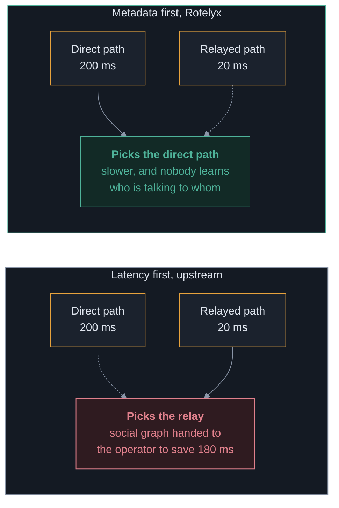

<div align="center">

<picture>
  <source media="(prefers-color-scheme: dark)" srcset="docs/brand/rotelyx-logo-dark.png">
  <source media="(prefers-color-scheme: light)" srcset="docs/brand/rotelyx-logo-light.png">
  
</picture>

**Peer to peer end to end encrypted messaging on a transport that lives in this repository.**

Identity is an Ed25519 key. No phone number, no email, no account, no directory.

[](#testing)
[](#running-it)
[](#licence)
[](#security-status)


</div>

---

> [!CAUTION]
> **Rotelyx is unaudited and pre release. Do not use it to protect anything.**
> It makes no security claims until the review gates in
> [`docs/THREAT-MODEL.md`](docs/THREAT-MODEL.md) section 5 are met.

---

## Table of contents

- [What Rotelyx is](#what-rotelyx-is)
- [The name](#the-name)
- [How a message travels](#how-a-message-travels)
- [Architecture](#architecture)
- [What each layer guarantees](#what-each-layer-guarantees)
- [Post quantum protection](#post-quantum-protection)
- [The blind mailbox](#the-blind-mailbox)
- [Reachability and abuse resistance](#reachability-and-abuse-resistance)
- [Path selection](#path-selection)
- [Contacting no third party infrastructure](#contacting-no-third-party-infrastructure)
- [Threat model summary](#threat-model-summary)
- [Comparison](#comparison)
- [Running it](#running-it)
- [Browser harness](#browser-harness)
- [Running your own relay](#running-your-own-relay)
- [Repository layout](#repository-layout)
- [Testing](#testing)
- [Provenance and licences](#provenance-and-licences)
- [Deployment](#deployment)
- [Roadmap](#roadmap)
- [Security status](#security-status)
- [Licence](#licence)

---

## What Rotelyx is

When both peers are online, messages travel **directly between devices** over
QUIC and touch no server at all. When a peer is offline, a sealed and padded
envelope is left in a **blind mailbox** that never learns the sender, never sees
plaintext, and that anyone can self host.

Three properties define the design:

| Property | How it is achieved |
|---|---|
| **No identity registry** | An identity is an Ed25519 keypair. Addresses are exchanged out of band. Nothing is published anywhere. |
| **Two independent encryption layers** | QUIC + TLS 1.3 at the transport, MLS at the message layer. No key material crosses between them, so breaking one does not break the other. |
| **Post quantum from day one** | X-Wing (ML-KEM-768 + X25519) injected into the MLS key schedule as an external pre shared key. |

### What Rotelyx deliberately is not

It is **not a mixnet**. It provides confidentiality and metadata minimisation,
not anonymity against an adversary watching the whole network. It does **not**
protect a compromised device. It does **not** claim deniability. Those
boundaries are written down in the threat model rather than glossed over,
because a threat model that only lists solved problems is marketing.

---

## The name

Rotelyx is built from the protocol itself:

```
ROT  --->  Rotating tags        mailbox addresses that rotate hourly and are unlinkable
E    --->  sealed Envelope      no sender field, no recipient identity, no plaintext length
LY   --->  LaYered encryption   two independent cryptographic layers
X    --->  X-Wing               the hybrid ML-KEM-768 + X25519 KEM
```

Every element is a component that actually exists in the code, not a marketing
gloss applied afterwards.

---

## How a message travels

The full path of a single message, from typing to reading.



**The direct path involves no server whatsoever.** The mailbox exists only for
the case where the recipient is not there, which on phones is most of the time.

---

## Architecture

Five layers. The two encryption layers are independent by construction.



### Why two independent layers

If TLS 1.3 inside QUIC were broken tomorrow, L2 would still hold. If a device
leaked an MLS epoch key, L1 and L0 would still deny an eavesdropper the raw
stream. **No key material is derived from one layer into the other.** That
separation is a design rule, not an accident.

---

## What each layer guarantees

| Layer | Crate | Guarantees | Does not guarantee |
|---|---|---|---|
| **L3** | `rotelyx-mailbox` | Operator sees no sender, no recipient identity, no plaintext, no message length | Timing correlation between deposit and collection. Deletion is enforced by code, not by protocol |
| **L2** | `rotelyx-crypto` | Forward secrecy, post compromise security, membership visible in commits, post quantum epoch keys | Anything once a device is compromised |
| **L1** | `rotelyx-core` | Peer authenticated by public key, admission control before any group crypto, length capped framing | That the key belongs to the person you mean. That is what safety numbers are for |
| **L0** | `rotelyx-net` | Direct paths preferred over relayed ones at any latency, no third party infrastructure contacted | That a direct path always exists. Roughly 10 to 20 percent of NAT pairs cannot be punched |

---

## Post quantum protection

### The problem

RFC 9420 defines only classical ciphersuites. The post quantum suites are still
in draft. A conversation recorded today can be decrypted later by an adversary
with a quantum computer, which is the harvest now decrypt later attack.

### What Rotelyx does

It does **not** invent a KEM combiner. It uses
[X-Wing](https://datatracker.ietf.org/doc/html/draft-connolly-cfrg-xwing-kem-10),
which is published, peer reviewed and deployed. Its security claim:

> The shared secret is secure if SHA3 is secure **and** *either* X25519 **or**
> ML-KEM-768 is secure.

Both would have to break at once.



### Why the pre shared key input rather than a fork

Two properties fall out of using the mechanism MLS already defines:

1. **Material refreshes per epoch** instead of being fixed at group creation.
2. **No member can inject a chosen PSK silently.** The proposal is part of the
   commit that every member validates, which is the same property that makes a
   ghost member addition visible.

> [!IMPORTANT]
> This composition is the **single novel cryptographic construction** in
> Rotelyx. It is roughly forty lines. It is small on purpose, and it is the
> specific item that must be independently reviewed before any release.

---

## The blind mailbox

### What the operator sees

Exactly two things: an opaque 32 byte tag, and a payload whose length is one of
five fixed values.



### Three design decisions worth explaining

**No length prefix is written.** The padding is trailing zeroes, and the
recipient recovers the real content because the inner MLS message is self
delimiting. Writing a length field would have been the natural thing to do and
would have handed the operator exactly the information the buckets exist to
hide.

**Addressing is never transmitted.** Both sides derive the tag key from the MLS
exporter secret. Nothing about where a message is addressed travels over the
network.

**Collection is destructive.** An envelope handed over is gone. A client that
crashes mid collection loses those messages. The alternative is a mailbox that
keeps copies, which is exactly what this is trying not to be.

### What the mailbox does not solve

An operator can retain envelopes past their TTL and correlate deposits with
collections by timing. **Deletion is a promise this code makes, not one the
protocol enforces.** The mitigation is not technical: the mailbox is a single
self hostable binary, so seizing one operator compromises one community rather
than a population.

---

## Reachability and abuse resistance

Free identities mean free spam. This is the property that removes phone numbers
from the design and the same property that made Kik a haven for unsolicited
contact. Cryptography does not fix it. Scarcity does.



### Why the proof of work is non transferable

The work binds to the sender, the recipient **and** the hour:

| Binding | What it prevents |
|---|---|
| **Recipient** | Work spent reaching one person cannot be reused on another. A bulk sender pays per recipient. |
| **Sender** | A spammer cannot solve once and reuse it across a fleet of throwaway identities. Each identity pays again. |
| **Hour** | Proofs cannot be stockpiled in advance, and they expire on their own. |

Together those force a choice: **reuse one identity and be blocked, or pay the
work for every new one.** That destroys the economics of bulk contact, which is
the actual threat. It does not stop a determined individual, and it is not meant
to.

### Revocation is surgical

Revoking a leaked invitation does not shut out holders of the others. Expiry is
a promise about the future. A leak is a problem right now.

---

## Path selection

The transport this is derived from selects network paths by latency. Rotelyx
selects by **metadata resistance**, and the two objectives genuinely conflict.



Three policies are available:

| Policy | Behaviour |
|---|---|
| `PreferDirect` **(default)** | Any direct path beats any relayed path at any latency. Falls back to a relay only when no direct path exists. |
| `DirectOnceAvailable` | As above, and never returns to a relay once direct. If the direct path dies, the connection dies. |
| `Fastest` | Upstream's objective. Provided so the privacy preserving policies have something to be measured against. |

**The cost is real latency, sometimes.** A direct path across the world can be
slower than a relay two hops away, and Rotelyx will take the slow one.

---

## Contacting no third party infrastructure

This is a hard requirement, enforced **structurally** rather than by
configuration:

- `RelayPolicy` has **no variant** meaning "the library's defaults"
- `AddressLookup` has **no variant** that publishes anywhere
- `NetConfig` has **no `Default` implementation**
- Peer discovery code is **deleted from the tree**, not disabled

A wrong configuration value is a bug you find in production. A missing
constructor is a bug you find at compile time.

### Enforced by test

`crates/rotelyx-net/tests/no_foreign_infrastructure.rs` binds live endpoints,
reads back the relay maps they actually hold, scans the whole workspace for
third party hostnames, and asserts that upstream environment overrides have no
effect. **If any of that stops holding, the build fails.**

Two rules, and the difference between them matters:

1. A foreign hostname **inside a Rust string literal** is always a failure. No
   exception mechanism exists, because a string literal is the shape of
   something the program can connect to.
2. Anywhere else, comments and manifests included, the occurrence must appear in
   `foreign-names-reviewed.txt` with a reason. Author attribution and
   documentation links are legitimate, and they are also exactly where a real
   endpoint could sit waiting to be uncommented.

The earlier version of this guard skipped comments and never looked at
manifests. It was then defeated by the project's own rebranding: a rename
rewrote `iroh` inside string literals, so `use1-1.relay.n0.iroh.link` became
`use1-1.relay.n0.rotelyx_transport.link` and stopped matching any token the
guard knew. The constants survived by being renamed. **A guard that matches on a
brand name is defeated by changing the brand name.**

---

## Threat model summary

Ten adversaries are modelled in [`docs/THREAT-MODEL.md`](docs/THREAT-MODEL.md).
The honest summary:

| Adversary | Defended | Notes |
|---|---|---|
| Passive network observer | Content, group membership | Flow existence is visible |
| Active network attacker | Content, membership, replay | Cannot deny denial of service |
| Relay operator | Content | **Sees which endpoint talks to which.** Inherent to relayed transport |
| Mailbox operator | Content, sender identity, message length | Timing correlation, and retention past TTL |
| Server seizure | Everything retroactively | No plaintext or keys exist on any server |
| **Compromised endpoint** | **Nothing** | The honest boundary of the entire system |
| Malicious group member | Silent additions are visible | A participant can always record and republish |
| **Global passive adversary** | **Nothing** | Rotelyx is not a mixnet. Such users need Tor |
| Push notification provider | Content | Sees that a device was woken, and when |
| Spam and abuse | Bulk contact economics | Not a determined individual attacker |

---

## Comparison

| Property | Telegram | Signal | Rotelyx |
|---|---|---|---|
| End to end encryption by default | No, secret chats only | Yes | Yes, no other mode exists |
| Group end to end encryption | None | Sender keys over Double Ratchet | MLS tree, O(log n) rekey |
| Identity | Phone number | Phone number | Ed25519 key, no personal data |
| Transport | To central servers | To central servers | Direct peer to peer, blind relay fallback |
| Post quantum | No | Yes | Yes, hybrid X-Wing |
| Self hostable | No | Not practically | Relay and mailbox both |
| Message length hidden | No | Partially | Yes, plaintext padded and envelopes bucketed |
| **Independent audit** | Protocol criticised repeatedly | **Repeatedly audited** | **None yet** |

That last row is the difference between a strong design and a trustworthy
product, and no amount of architecture closes it.

---

## Running it

Requires Rust 1.85 or newer.

```sh
cargo build -p rotelyx-cli
R=./target/debug/rotelyx-cli
```

### Terminal 1, issue an invitation and wait

```sh
$R --identity alice.key invite --hours 24
#   7otIsVn_jAFHYFb1Yp62rDxm5spaU75eM5MoDSHosgo

$R --identity alice.key listen
#   listening as 660daca6...
#   rotelyx connect 'eyJpZCI6...'
```

### Terminal 2, connect with both the address and the invitation

```sh
$R --identity bob.key connect 'eyJpZCI6...' \
   --invite 7otIsVn_jAFHYFb1Yp62rDxm5spaU75eM5MoDSHosgo
```

Both sides print a safety number:

```
peer          2af65b693779a3163f0519ac0cced6bd208cd09ee8de796dba0999edbbaabb92
safety number 41908 75433 94850 77313 01440 94499 53654 59718 70563 59440 56977 54559
```

> [!TIP]
> **Compare those digits out loud before trusting the session.** The transport
> authenticated a key, not a person. If they differ, someone is in the middle.

### Two behaviours that are deliberate

**`listen` refuses to start without a live invitation.** An identity is
unreachable by default. `--open` exists and has to be typed.

**A refused caller sees only that the connection closed.** A detailed reason
would turn every identity into an oracle for its own reachability policy.

---

## Desktop app

A native window over the same stack: real QUIC, real MLS, real admission
control, sealed identity on disk. No Node and no bundler, because the frontend
is plain HTML.

```sh
cargo build -p rotelyx-desktop
./scripts/rotelyx-desktop
```

Build prerequisites on Debian or Ubuntu:

```sh
sudo apt install -y libwebkit2gtk-4.1-dev build-essential curl wget file \
  libxdo-dev libssl-dev libayatana-appindicator3-dev librsvg2-dev \
  libasound2-dev cmake
```

To run two of them side by side, point each at its own identity:

```sh
ROTELYX_IDENTITY=alice.key ./scripts/rotelyx-desktop &
ROTELYX_IDENTITY=bob.key   ./scripts/rotelyx-desktop &
```

> [!NOTE]
> **Tauri IPC is in process, so plaintext never crosses a socket.** This is the
> meaningful difference from the browser harness below, which speaks over
> loopback and therefore admits anything on the machine that can reach that
> port. What remains outside the boundary is the operating system and anything
> with code execution on the device, which is unavoidable in any client that
> draws a message on a screen.

`scripts/rotelyx-desktop` clears snap runtime variables before launching. A
terminal started from inside a snap, VS Code's for example, leaks its own
library paths and a normally linked binary then dies on the snap's libpthread.
The wrapper changes nothing about Rotelyx, it only stops a foreign runtime
being injected underneath it.

## Browser harness

For clicking rather than typing. No Node, no bundler, no CDN: one Rust binary
serving one self contained page.

```sh
cargo build -p rotelyx-web

./target/debug/rotelyx-web --identity alice.key --bind 127.0.0.1:8081
./target/debug/rotelyx-web --identity bob.key   --bind 127.0.0.1:8082
```

Open both tabs, issue an invitation in the first, press **Listen**, then paste
its address and invitation into the second and press **Connect**.

The page shows the safety number and whether the session is on a **direct path**
or **relayed**.

> [!WARNING]
> **The browser is outside the encryption boundary.** Plaintext travels from the
> page to the local process over loopback, and encryption happens in the
> process. Acceptable for a harness, unacceptable for a product, where the
> crypto belongs in the same trust domain as the display.

---

## The real browser client

Different thing from the harness above. Here the encryption runs **in the
page**, compiled to WebAssembly, and the server it talks to holds no key.

```sh
rustup target add wasm32-unknown-unknown
cargo install wasm-bindgen-cli --version 0.2.127   # must match the crate exactly

cargo build -p rotelyx-wasm --target wasm32-unknown-unknown --release
wasm-bindgen target/wasm32-unknown-unknown/release/rotelyx_wasm.wasm \
  --out-dir site/rotelyx --target web --no-typescript
```

Then run a mailbox and serve `site/`:

```sh
cargo run -p rotelyx-mailbox-server -- --bind 127.0.0.1:3341
(cd site && python3 -m http.server 8087)
```

Open `http://127.0.0.1:8087/chat.html` in two tabs, point both at
`ws://127.0.0.1:3341/mailbox`, type the same meeting phrase, and have one press
**Open and wait** while the other presses **Join**.

### What is the same, and what is not

| | Native client | Browser client |
|---|---|---|
| Message confidentiality | MLS with hybrid PQ | **Identical** |
| Message integrity | MLS | **Identical** |
| Padding and rotating tags | Yes | **Identical** |
| Direct peer to peer path | Preferred over any relay | **Never** |
| Who learns two parties talk | Nobody, on a direct path | **The mailbox operator, always** |
| Code integrity | Verify the binary once | **Trust the server on every load** |

> [!WARNING]
> **A browser cannot open a UDP socket.** QUIC and hole punching cannot run
> there, so every browser message goes through the mailbox and the operator
> always learns that two parties are talking. On a direct path nobody does.
>
> **The page is re delivered on every load.** An installed binary is verified
> once; a server could serve different code to one visitor. This is not in the
> threat model, which assumes an installed binary.
>
> Use it to try Rotelyx and to reach a device that cannot install anything. Do
> not use it where a compromised operator is in scope.

### The meeting phrase is not authentication

Two people who have never exchanged a key need somewhere to put the first
message, so both type the same phrase and it becomes one mailbox slot. Nothing
in the handshake needs to be private: a key package is public, a welcome is
encrypted to the joiner's own key, and the hybrid ciphertext is encapsulated to
their public key.

What the phrase does not do is prove who answered. Anyone who learns it first
can reply in the intended party's place. **Comparing the safety number aloud is
the only thing that detects this**, which is why the page shows it before it
lets you type.

---

## Calls, and the codec under them

Two things make Rotelyx's voice channel different from every other messenger's,
and both follow from one decision: **delay is spendable**.

### Fidelity mode

Every real-time media stack optimises latency and accepts loss, because a
telephone call needs it. Rotelyx offers that, and offers the opposite.

In fidelity mode the buffer runs seconds deep, missing frames are asked for
again rather than concealed, and a playback slot waits rather than producing a
gap. Measured with the retransmissions dropping at the same rate as the
originals:

| packets lost | frames lost | worst delay |
|---|---|---|
| 10% | none | 1980 ms |
| 30% | none | 1980 ms |
| 50% | none | 1980 ms |
| 70% | none | 1980 ms |
| 80% | none | 2040 ms |
| 90% | none | 2200 ms |
| 95% | none | 2380 ms |
| 98% | none | 3989 ms |

**Loss costs delay and never costs words.** With one packet in fifty getting
through, every frame still arrives, four seconds late.

Getting there needed one fix that only appeared above one packet in two. A
receiver knows a frame is missing because it can see the gap, and it cannot see
a gap *before the first frame it ever received*: nothing tells it those frames
existed. So the start of a call, everything lost before anything got through,
was never requested by anybody. It cost the first 260 ms on every run at 80%
loss, no amount of recovery time helped because the request was never made, and
it was invisible at every rate up to a half. The sender now reports the earliest
counter it can still supply, and the receiver reaches back to it.

A deep buffer is time, and time is enough round trips to get back what the
network threw away. Nobody else builds this because nobody else starts from
"delay does not matter".

### Calls are never on a direct path

Messages prefer any direct path over any relayed one, because a relay learns who
talks to whom and the alternative exposure is to an operator.

**Calls invert that.** On a direct path the other party learns your address, and
in a group call every participant does. So `PathPolicy::RelayOnly` never selects
a direct path whatever is on offer, and a media session refuses to be built on
any policy that permits one. There is no switch.

### Telyx

Opus is excellent and is not going to be beaten at its own objective, which is
quality per bit under a hard twenty millisecond latency budget. That budget is
the constraint its whole design bends around: short windows, no lookahead, and
loss concealment inside the codec because the transport cannot recover anything
in time.

Our channel has none of the three. Telyx is the codec that constraint produces:
a 40 ms MDCT window, Bark-spaced bands, energy and shape coded separately, and
PVQ for the shape.

| kbit/s | SNR |
|---|---|
| 6 | refused: the band energies alone need 18 bytes |
| 8 | 2.7 dB |
| 12 | 12.8 dB |
| 16 | 20.2 dB |
| 24 | 28.2 dB |
| 32 and above | 29.2 dB |

All of it on **one synthetic signal**: twelve harmonics with vibrato, a formant
and an amplitude envelope. On actual speech the same codec at the same rates
scores roughly half as many decibels:

| clip | 12 kbit/s | 16 kbit/s | 24 kbit/s |
|---|---|---|---|
| digits | 7.3 dB | 9.9 dB | 12.4 dB |
| fricatives | 8.4 dB | 10.4 dB | 11.7 dB |
| nasals | 14.5 dB | 17.6 dB | 21.1 dB |
| plosives | 10.5 dB | 13.8 dB | 17.8 dB |
| sibilants | 10.6 dB | 13.3 dB | 16.1 dB |
| transients | 7.7 dB | 10.8 dB | 14.1 dB |
| *synthetic vowel* | *12.8 dB* | *20.2 dB* | *28.2 dB* |

Six clips of neural text-to-speech at 22.05 kHz, resampled to 48 kHz: synthetic,
but with the structure of speech rather than an imitation of its spectrum.

The cause is not the resampling. **No bits at all are spent above 11 kHz**, so
the empty top half costs nothing. It is that the synthetic signal keeps 13 of
the 24 bands awake and speech keeps 21: the same sixty bytes spread over 21
bands instead of 13. The codec had been tuned, measured and reported against a
signal materially easier than the one it exists for.

**But the single figure is the wrong way to read it**, and breaking it down by
band says why. At 24 kbit/s:

| region | bits/coefficient | SNR | share of all error |
|---|---|---|---|
| 0-800 Hz | 2.5 to 4.3 | 25 to 29 dB | 3.4% |
| 800 Hz - 3 kHz | 1.2 to 2.4 | 8.6 to 21.6 dB | 10.8% |
| 3 - 12 kHz | 0.01 to 0.78 | -2.5 to 5.3 dB | **85.7%** |

Speech keeps about 79 percent of its energy below 800 Hz, and there the codec
reaches 25 to 29 dB. The 3 to 12 kHz region holds under one percent of the
energy, is deliberately given almost no bits, and produces 86 percent of the
error the single number reports. So that number is largely a measurement of the
bands the codec has chosen to starve, weighted as though they mattered as much
as the ones carrying the voice.

That does not make the codec good. It makes signal to noise the wrong
instrument, which is the same conclusion the fricative reached from the other
direction. Whether starving 3 to 12 kHz is the right decision is a question
about hearing, and no measurement here can answer it. Retuning the allocator
against SNR would be worse than useless: the energy is all at the bottom, so the
optimiser would strip the top of the spectrum, raise the number, and sound more
muffled.

Encoding and decoding together cost 1.2% of real time on one core. That number
is new, and until it existed none of the others meant much: the transform was
written from its definition, which is O(n²), and cost **270% of real time by
itself**. Every quality figure recorded before that was fixed was measured
offline on a codec that could not have carried a conversation. Factored through
an FFT the transform is 540 times faster and, because an FFT accumulates in a
tree rather than a line of 1920 additions, 775 times more accurate.

**Nobody has listened to it.** Every number above is objective, codec quality is
not, and no comparison with any other codec may be made until a listening test
has happened. Opus's decade of advantage is precisely that tuning.

### Running the listening test

```sh
cargo run --release -p rotelyx-codec --example bake_listening_test
scripts/listen                 # one clip, eight versions, random order
scripts/listen --reveal        # scores, with the mapping
```

Eight versions of each clip: the untouched original, Telyx at 12/16/24 kbit/s,
Opus at the same three rates, and the original low-passed at 3.5 kHz. All
trimmed to the same length and named with a meaningless six letter tag, so a
listener has nothing to go on but the sound. The mapping is in `key.txt` and the
whole exercise is worthless if it is read first.

Two of the eight test the listener rather than the codec. The hidden original
should score near 100; if it does not, that session's data is not usable. The
3.5 kHz version is roughly what a telephone sounds like, which gives the bottom
of the scale a meaning everybody shares. The rating scale is MUSHRA's, so the
numbers can be compared with published tests of other codecs.

### What happened when it was given sounds it had never been given

Every figure in this project had been measured on one sustained vowel. Speech is
not made of sustained vowels, so the codec was given the things it had never
seen: a plosive, a fricative, and an onset after silence.

| signal | 12 kbit/s | 24 kbit/s |
|---|---|---|
| sustained vowel | 11.9 dB | 24.0 dB |
| voiced onset | 12.7 dB | 23.9 dB |
| fricative /s/ | -2.7 dB | -1.9 dB |
| plosive /t/ | -2.8 dB | -1.8 dB |

The negative numbers are **not** straightforwardly a failure, and that is the
first useful thing the exercise produced. A fricative is noise: the codec
reproduces its spectrum and not its waveform, and two different noises with
identical spectra sound the same and score about 0 dB against each other. Which
is a demonstration, from our own codec, of why no SNR comparison against Opus
would mean anything.

Three real defects did fall out, none of which any existing test could see:

**The noise fill was not noise.** A band with no bits gets an invented texture,
and that texture was a hash of the coefficient index and nothing else, so it was
the *same pattern in every frame, for ever*. A decoded fricative correlated with
itself one frame later at **+0.991**, against +0.008 for the noise going in.
That is not a hiss, it is a tone at the frame rate, and 48000/960 is 50 Hz. An
/s/ came out as a buzz. Signal to noise cannot see this, the level is right
throughout, and every round trip test passed either way. Now seeded from the
decoder's frame counter: +0.010.

**A rate too low to carry the envelope was delivered rather than refused.** The
encoder finished a frame with `resize(bytes_per_frame, 0)`, which pads and also
truncates, and the truncating case had never been considered. At 15 bytes a
frame the band energies alone need 18, so the last bands were cut off, read back
out of the zero padding, and the whole frame decoded 6 dB quiet. Silently. It
had been published as the 6 kbit/s row of the table above.

**Pre-echo is real and unfixed.** A plosive puts noise 14.8 dB below itself into
the silence *before* it, because a 40 ms window spreads quantisation error over
its whole length. That is the known cost of the long window and the fix is block
switching, which is not built. It is measured and written down now instead of
being discovered by a listener.

### What the band energies cost, and what they were costing us

A band's energy was written at six bits, eighteen bytes of a sixty byte frame,
and getting that number down took four attempts. Three of them are worth having
written down because each one was wrong in a different way.

**The floor was measured wrong.** A helper in a test multiplied each symbol's
surprise by its own count instead of by the total, and reported the entropy of
the energies as under two bytes a frame. The real figure is about fifteen. Every
design decision aimed at that gap was aimed at a saving that did not exist.

**The prediction was pointed at the wrong axis.** Each band was predicted from
the same band in the previous frame, which is the obvious design. What moves
fastest in a voice is the overall level, and 20 ms is long enough for it to move
a great deal; what barely moves is the shape of the spectrum. Predicting each
band from the band below it, inside the same frame, went from 15.4 to 12.9 bytes
a frame, and made every frame independent of every other into the bargain.

**The coder was flushed fifty times a second.** An arithmetic coder must be
closed before its output can be read, and closing costs four to six bytes
whatever it carries. Batching ten frames into one stream pays it once. That is
`rotelyx-codec::grouped`, and it costs 200 ms of latency, which is exactly the
kind of thing this channel has to spend.

**The energy step was the ceiling all along.** The codec saturated at 26.3 dB
however many bits it was given, and nobody had asked why. A 1.5 dB quantiser has
an rms error of 0.43 dB, and 0.43 dB of gain error predicts 25.9 dB of SNR. Every
bit above 24 kbit/s was refining a shape that was then multiplied by the wrong
number. The step is now chosen from the frame size, which both sides already
know, so it costs nothing to signal: coarse where the envelope would crowd out
the shapes, fine where the envelope is what limits us.

### What the military vocoders had to teach us

MELP, MELPe (STANAG 4591) and Codec 2 run at 600 to 2400 bit/s, an order of
magnitude below Telyx, and most of their machinery does not cross: they are
parametric vocoders that resynthesise speech from pitch, voicing and an LPC
envelope, where Telyx codes a transform of the waveform. Mixed excitation,
bandpass voicing, pulse dispersion and aperiodic jitter all act on an excitation
signal Telyx does not have.

Two things did cross, and both arrived as confirmation rather than as news:

- **MELPe at 600 bit/s groups four frames into a superframe and quantises them
  jointly**, for the same reason `grouped` batches ten. Independently reaching a
  design that a NATO standard reached is not proof it is right, but it is a good
  deal better than reaching it alone.
- **Codec 2 700C delta-codes its mel-spaced spectral envelope along frequency**,
  and deliberately avoids differential coding in time so that a bit error cannot
  propagate. That is the predictor above and the second reason for it, which we
  had not thought of.

One thing did not cross and should have been tried anyway: Codec 2 found 6 dB
envelope steps cost it very little. They cost Telyx 13.7 dB of SNR, because a
vocoder resynthesises from the envelope while Telyx multiplies its coefficients
by it, so an envelope error is a gain error on the output. Worth measuring,
worth not assuming.

Still unexplored from that quarter: MELPe's noise pre-processor, built for
battlefield noise and relevant to anyone on a phone in a loud room, and the
analysis-by-synthesis idea from CELP, which picks the quantiser index that
minimises perceptual error rather than the one nearest in the parameter domain.
Telyx's residual quantiser currently does the latter.

### Layers

A frame is a base plus three refinements, each optional and each improving on
the last. One encode serves every rate: a listener on a poor link is sent the
base and stops, the same recording sent elsewhere carries every layer, and
nothing is re-encoded or stored twice.

This is worthless on a telephone call, where a refinement arriving after its
frame has played is discarded. On a channel that already spends delay and
recovers loss, a refinement that arrives late is a refinement that arrives.

The layers now cross the transport. A frame serialises with a byte of layer
count and a length for each layer but the last, so the sender trims to whatever
the link will carry before it protects the frame, and a second listener on a
worse connection costs no second encode. The whole path is tested end to end:
encode, trim, protect, cross a wire, authenticate, parse, decode.

They do **not** get a datagram each, and that was costed rather than assumed.
Every datagram carries its own sixteen byte tag, and on frames this small the
tag is most of the packet:

| stream | one datagram | one datagram per layer |
|---|---|---|
| 12 kbit/s | 19.6 kbit/s on the wire | 42.4 |
| 16 kbit/s | 23.6 | 46.4 |
| 24 kbit/s | 31.6 | 54.4 |

Splitting a 24 kbit/s stream four ways costs more bandwidth than the stream
carries.

**Trimming currently saves about a tenth**, and the reason is worth stating
plainly rather than leaving as a disappointment: the base layer is 86 percent of
a frame, so dropping every refinement can save at most fourteen percent, and 44
percent of the base is the energy envelope. The mechanism is built and correct
and the payoff waits on a smaller base. Coding the energies across a group of
frames gets them from 20.3 bytes to 12.4, but it costs 200 ms of batching, which
the mailbox can spend and a call cannot.

What is not built: block switching, long term prediction, device capture, echo
cancellation, and a trained vector quantiser for the envelope, which is the
largest remaining saving and needs a speech corpus.

---

## Running your own blind mailbox

The mailbox exists for two peers that are never online at the same time, and
for browsers, which have no other option. It holds no key and cannot read a
byte of what it stores.

```sh
cargo build -p rotelyx-mailbox-server
./target/debug/rotelyx-mailbox-server --bind 0.0.0.0:3341
```

That is the whole command. There is no key to obtain and nothing to pay for: a
mailbox started this way accepts no capability tokens and serves everyone the
free tier, which is a real tier and not a demo. Selling access is a separate
program that is not in this repository and that nobody needs in order to run
one of these. See [`docs/BILLING.md`](docs/BILLING.md).

| Observable | Visible to the operator |
|---|---|
| Contents, length, sender, recipient | No |
| Which tags exist and when they are busy | **Yes** |
| Which tags one connection asks for together | **Yes** |
| Connecting addresses | **Yes** |

Two behaviours worth knowing before you run one. **Delivery is exactly once**:
collection removes, so two devices polling the same tag race and one loses the
message. That is a real limit on multi device use and it beats a mailbox that
keeps copies of what it delivered. **Nothing survives a restart**: every
uncollected envelope is dropped, and encrypted persistence is not implemented.

---

## Running your own relay

A relay exists for one case: two peers that cannot hole punch through their
NATs. It forwards QUIC ciphertext and holds no keys.

```sh
cargo build -p rotelyx-relay

rotelyx-cli --identity alice.key id >> community.allow

./target/debug/rotelyx-relay --bind 0.0.0.0:3340 --allow community.allow
```

### Two refusals that matter

It refuses to start **without an explicit policy**, and refuses to start on an
**empty allowlist** rather than falling open. A relay that silently serves the
whole internet is the failure nobody notices, because it works perfectly.

> [!IMPORTANT]
> **A relay learns which endpoint talks to which, and when.** That is the social
> graph. It is inherent to relayed transport and no configuration removes it.
> Run your own so that pairing is visible to you rather than to a stranger.

No metrics endpoint is exposed. Telemetry in a privacy tool is an operational
record of who connected and when, sitting in a second place with weaker access
control than the relay itself.

---

## Repository layout

```
crates/
  rotelyx-net       L0/L1  transport, relay policy, path policy
                           NOTICE, VENDORING.md, LICENSE-{MIT,APACHE,BSD3}
  rotelyx-core      L1     identity, admission control, safety numbers, framing
  rotelyx-crypto    L2     MLS integration and the hybrid PQ composition
  rotelyx-mailbox   L3     blind store and forward, self hostable
  rotelyx-codec           Telyx, a transform speech codec for a channel where
                           latency is spendable and loss is recovered. MDCT,
                           Bark bands, PVQ shape coding, residual stages
  rotelyx-media     L2     calls: per sender frame encryption keyed from MLS, an
                           adaptive jitter buffer with a loss recovery mode that
                           survives 50% packet loss, QUIC datagrams, never direct
  rotelyx-wasm      L2/L3  the message layer compiled for the browser
  rotelyx-capability       capability tokens: the format, and verifying them.
                           Issuing them is a separate crate, not published here,
                           so a mailbox runs free without any of it. See
                           docs/BILLING.md
  rotelyx-status           the availability record behind both landing pages
  rotelyx-mobile           the C ABI the phone bindings call
  rotelyx-cli              two terminal chat, for running the protocol
  rotelyx-relay            the relay server binary
  rotelyx-mailbox-server   the blind mailbox as a WebSocket service
  rotelyx-desktop          native desktop window, Tauri v2, no Node
  rotelyx-web              local browser harness
  net/                     the vendored transport stack, 121,197 lines
site/                          the public site and the browser client, self contained
docs/
  brand/                       logo, light and dark variants, and the square mark
  BILLING.md                   what is not in this repository, and why
  DEPLOYMENT.md                what is deployed, where, and why each choice was made
  THREAT-MODEL.md              what Rotelyx defends against, and what it does not
  PQ-COMPOSITION.md            the novel construction, specified for review
  rotelyx-architecture.html    the architecture assessment
TODO.md                        what is done, what is next, what is blocked
```

---

## Building and memory

The vendored transport is 121,000 lines and includes a 50,000 line QUIC state
machine. Cargo defaults to one compile job per core, and on a machine with a
small swap file that peak is enough to make the kernel start killing processes.
An editor is a large, easy target.

`.cargo/config.toml` in this repository caps the build at four jobs for that
reason. Raise it if you have RAM headroom:

```sh
cargo build --workspace -j 8
```

If builds still stall the machine, more swap helps more than fewer jobs:

```sh
sudo fallocate -l 8G /swapfile2 && sudo chmod 600 /swapfile2
sudo mkswap /swapfile2 && sudo swapon /swapfile2
```

## Testing

```sh
cargo test --workspace
```

**450 tests**, and 11 more in the issuer crate that is not published here. The
distribution matters more than the count:

| Suite | Tests | What it proves |
|---|---:|---|
| `rotelyx-codec` | 71 + 12 | The transform, the quantiser, real speech, and every corrupted frame |
| `rotelyx-core` | 59 + 10 | Identity, sealed storage, framing, admission control **over real sockets** |
| `rotelyx-mailbox-server` | 45 | Deposits, fan-out, tiers, quota, the vault, waking a phone |
| `rotelyx-media` | 44 + 6 | Per sender keys, the jitter buffer, layers crossing a real wire |
| `rotelyx-wasm` | 31 | The message layer as the browser sees it |
| `rotelyx-mailbox` | 29 + 6 | Envelopes, buckets, tag rotation, TTL expiry |
| `rotelyx-capability` | 24 | Token format and verification, against tokens frozen from the real issuer |
| `rotelyx-crypto` | 23 + 12 | MLS conversations, X-Wing, the PQ secret reaching the key schedule |
| `rotelyx-net` | 15 + 10 | Path policy, the zero foreign infrastructure guard, **live QUIC connections** |
| `rotelyx-relay` | 12 + 3 | Admission limits, the allowlist refusing to fall open, the status page |
| `rotelyx-mobile` | 9 | The C ABI boundary, and audio across it |
| `rotelyx-status` | 7 | The availability record both landing pages read |
| `rotelyx-cli` | 6 + 6 | Key file sealing and migration, plus a message surviving the whole offline path |
| `rotelyx-desktop` | 6 | The native window's handshake and key file |
| `rotelyx-web` | 4 | The local browser harness |

Hostile input tests run in five crates and account for 33 of the total: every
truncation, every byte value at every position, extension, and arbitrary input,
against every parser reachable before anything has been authenticated.

### Three defects found by testing, not by review

Every unit test passed while these were live. Only cross layer tests and tests
over real sockets found them:

1. **MLS was not padding at all.** Overhead is a constant 145 bytes and the rest
   is one to one, so plaintext length leaked exactly. Worst on the direct path,
   where there is no envelope to hide behind.
2. **Padding buckets were too small.** A 256 byte bucket held barely a hundred
   characters after MLS overhead, so ordinary messages straddled the boundary
   and told the operator "short" or "long" every time.
3. **Dropped QUIC streams discarded data.** A send stream dropped without
   finishing resets and silently discards data the sender believes was
   delivered. Write then drop is the obvious pattern, and it lost the last
   message with no error anywhere.

---

## Provenance and licences

Rotelyx's transport is **derived from [iroh](https://github.com/n0-computer/iroh)**
and vendored into this repository. No upstream networking package is downloaded.

The lineage is worth stating plainly:


**Nobody in this lineage wrote NAT traversal from zero.** Tailscale did the
original work, N0 derived from it, Rotelyx derives from that. Building on it is
the normal case, not the exception.

### The defensible claim

> Rotelyx ships its own transport, derived from iroh and substantially rewritten
> for metadata resistance.

### The indefensible one

> We wrote a transport library from scratch.

Do not make it. Full provenance, licence obligations and the per subsystem
replacement plan are in
[`crates/rotelyx-net/VENDORING.md`](crates/rotelyx-net/VENDORING.md) and
[`crates/rotelyx-net/NOTICE`](crates/rotelyx-net/NOTICE). Those notices are a
licence obligation and must not be removed.

---

## Deployment

Hosts, nginx configuration, firewall rules and verification commands are in
[`docs/DEPLOYMENT.md`](docs/DEPLOYMENT.md).

## Roadmap

Full status in [`TODO.md`](TODO.md). The short version:

**Done.** Transport vendored and renamed, zero foreign infrastructure with a
build breaking guard, MLS conversations, hybrid post quantum key agreement
reaching the MLS key schedule, blind mailbox, admission control enforced on the
accept path, metadata resistant path selection, relay server, CLI and browser
harnesses.

**Next.** Field test across two real NATs, published test vectors for the PQ
composition, audio calls, mobile clients.

**Blocking any public security claim.** An independent cryptographic audit.

---

## Security status

Rotelyx makes **no claim** of being unbreakable, un interceptable or impossible
to access. Those claims are false for every system that has ever made them.

What it claims is bounded, written down and testable. See
[`docs/THREAT-MODEL.md`](docs/THREAT-MODEL.md).

---

## Licence

**GNU Affero General Public License v3** ([`LICENSE`](LICENSE)). Run your own
relay, your own mailbox, your own client; publish what you change if you offer
it over a network.

The transport stack under `crates/net/` is derived from other projects and
stays under the licences they granted: MIT, Apache-2.0 and BSD-3-Clause. See
[`LICENSING.md`](LICENSING.md) for what is under which, and
[`crates/rotelyx-net/NOTICE`](crates/rotelyx-net/NOTICE) for provenance.

Rotelyx is a trademark. The licence covers the code, not the name.

<div align="center">


</div>
