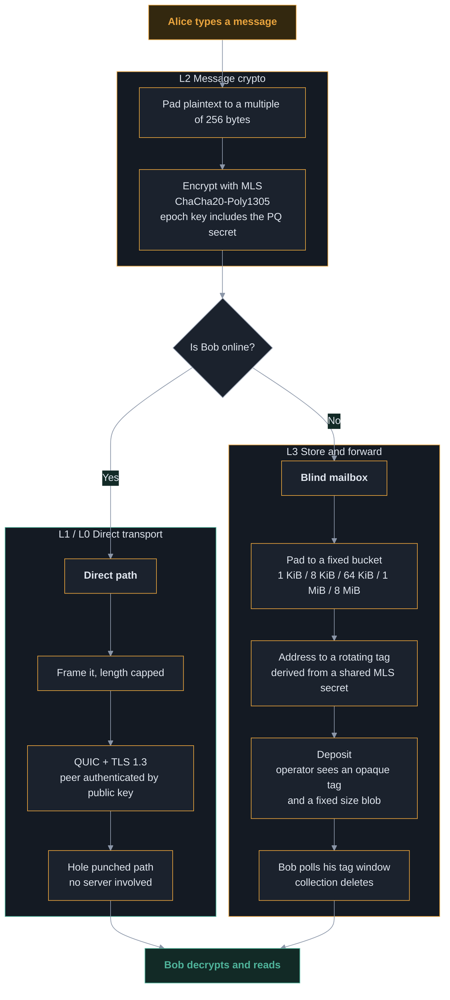
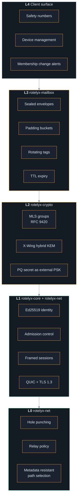
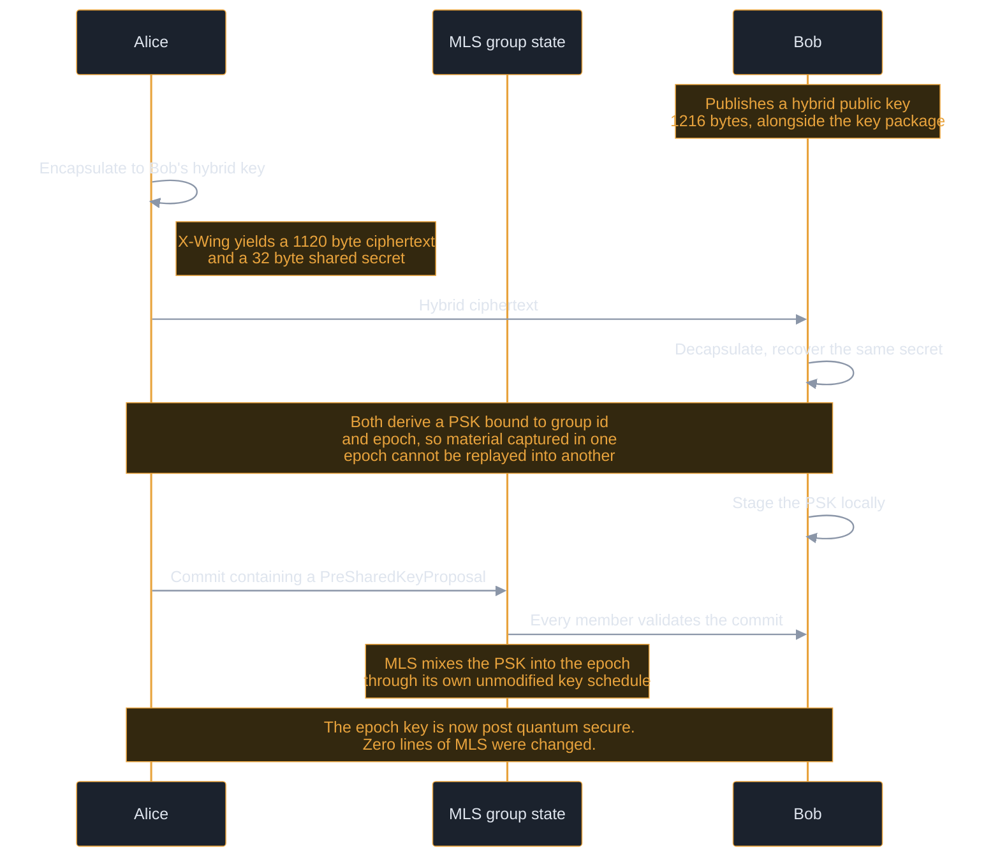
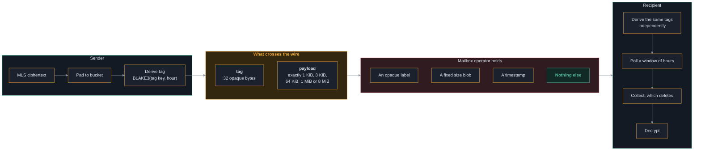
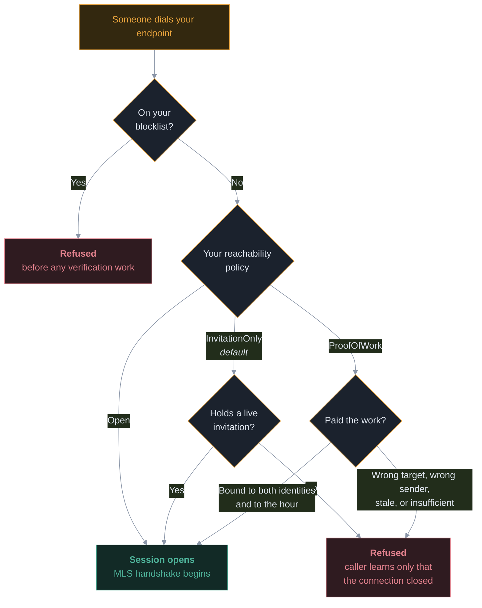
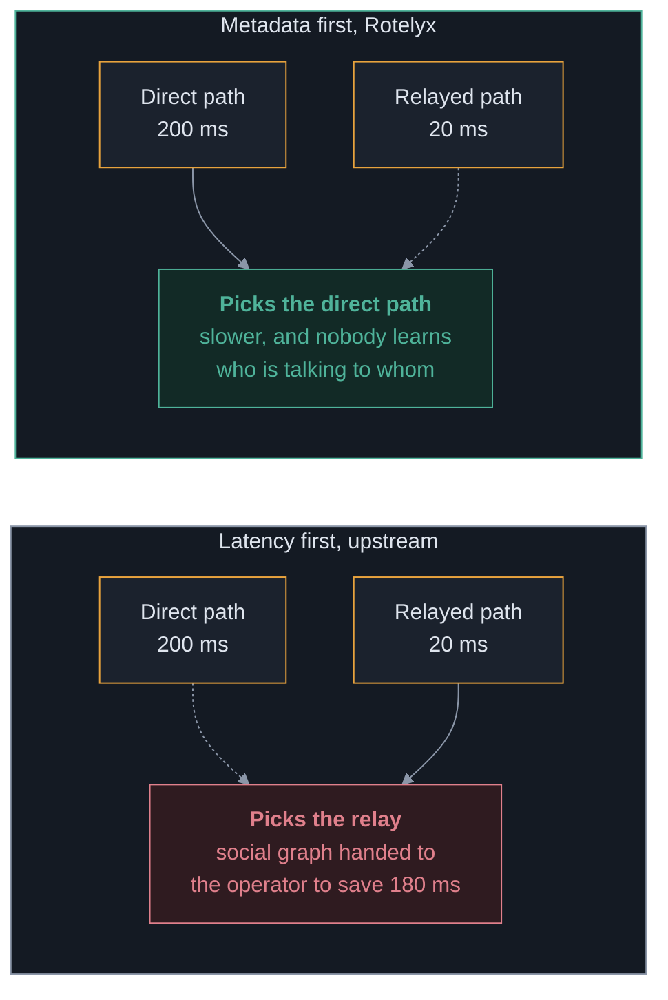

# Architecture

How Rotelyx is put together, for somebody who wants to read the code or check
the design. If you only want to run it, the [README](../README.md) is enough.

## How a message travels

The full path of a single message, from typing to reading.

**The direct path involves no server whatsoever.** The mailbox exists only for
the case where the recipient is not there, which on phones is most of the time.

---

## Architecture

Five layers. The two encryption layers are independent by construction.

### Why two independent layers

If TLS 1.3 inside QUIC were broken tomorrow, L2 would still hold. If a device
leaked an MLS epoch key, L1 and L0 would still deny an eavesdropper the raw
stream. **No key material is derived from one layer into the other.** That
separation is a design rule, not an accident.

---

## What each layer guarantees

| Layer | Crate | Guarantees | Does not guarantee |
|---|---|---|---|
| **L3** | `rotelyx-mailbox` | Operator sees no sender, no recipient identity, no plaintext, no message length | Timing correlation between deposit and collection. Deletion is enforced by code, not by protocol |
| **L2** | `rotelyx-crypto` | Forward secrecy, post compromise security, membership visible in commits, post quantum epoch keys | Anything once a device is compromised |
| **L1** | `rotelyx-core` | Peer authenticated by public key, admission control before any group crypto, length capped framing | That the key belongs to the person you mean. That is what safety numbers are for |
| **L0** | `rotelyx-net` | Direct paths preferred over relayed ones at any latency, no third party infrastructure contacted | That a direct path always exists. Roughly 10 to 20 percent of NAT pairs cannot be punched |

---

## Post quantum protection

### The problem

RFC 9420 defines only classical ciphersuites. The post quantum suites are still
in draft. A conversation recorded today can be decrypted later by an adversary
with a quantum computer, which is the harvest now decrypt later attack.

### What Rotelyx does

It does **not** invent a KEM combiner. It uses
[X-Wing](https://datatracker.ietf.org/doc/html/draft-connolly-cfrg-xwing-kem-10),
which is published, peer reviewed and deployed. Its security claim:

> The shared secret is secure if SHA3 is secure **and** *either* X25519 **or**
> ML-KEM-768 is secure.

Both would have to break at once.

### Why the pre shared key input rather than a fork

Two properties fall out of using the mechanism MLS already defines:

1. **Material refreshes per epoch** instead of being fixed at group creation.
2. **No member can inject a chosen PSK silently.** The proposal is part of the
   commit that every member validates, which is the same property that makes a
   ghost member addition visible.

> [!IMPORTANT]
> This composition is the **single novel cryptographic construction** in
> Rotelyx. It is roughly forty lines. It is small on purpose, and it is the
> specific item that must be independently reviewed before any release.

---

## The blind mailbox

### What the operator sees

Exactly two things: an opaque 32 byte tag, and a payload whose length is one of
five fixed values.

### Three design decisions worth explaining

**No length prefix is written.** The padding is trailing zeroes, and the
recipient recovers the real content because the inner MLS message is self
delimiting. Writing a length field would have been the natural thing to do and
would have handed the operator exactly the information the buckets exist to
hide.

**Addressing is never transmitted.** Both sides derive the tag key from the MLS
exporter secret. Nothing about where a message is addressed travels over the
network.

**Collection is destructive.** An envelope handed over is gone. A client that
crashes mid collection loses those messages. The alternative is a mailbox that
keeps copies, which is exactly what this is trying not to be.

### What the mailbox does not solve

An operator can retain envelopes past their TTL and correlate deposits with
collections by timing. **Deletion is a promise this code makes, not one the
protocol enforces.** The mitigation is not technical: the mailbox is a single
self hostable binary, so seizing one operator compromises one community rather
than a population.

---

## Reachability and abuse resistance

Free identities mean free spam. This is the property that removes phone numbers
from the design and the same property that made Kik a haven for unsolicited
contact. Cryptography does not fix it. Scarcity does.

### Why the proof of work is non transferable

The work binds to the sender, the recipient **and** the hour:

| Binding | What it prevents |
|---|---|
| **Recipient** | Work spent reaching one person cannot be reused on another. A bulk sender pays per recipient. |
| **Sender** | A spammer cannot solve once and reuse it across a fleet of throwaway identities. Each identity pays again. |
| **Hour** | Proofs cannot be stockpiled in advance, and they expire on their own. |

Together those force a choice: **reuse one identity and be blocked, or pay the
work for every new one.** That destroys the economics of bulk contact, which is
the actual threat. It does not stop a determined individual, and it is not meant
to.

### Revocation is surgical

Revoking a leaked invitation does not shut out holders of the others. Expiry is
a promise about the future. A leak is a problem right now.

### Every invitation is a different address

An endpoint that answers under one key is reachable at one address for
everybody, and anything carrying that traffic sees which address talks to which.
Two people you invited could compare notes and find they had been given the same
one. So an invitation carries an address of its own, and the code you hand out
is that address as well as the permission to use it.

One endpoint answers all of them at once, on one socket and one relay
connection, by two arrangements that are made together:

| Half | What it does | Where it lives |
|---|---|---|
| **Answering** | The TLS resolver holds every key and picks by the endpoint id in the ClientHello, which arrives before any key has to be produced | This process |
| **Being found** | The relay is asked to route the address to this connection, and does so only for a connection that signed a binding with the key itself | The relay's memory |

Neither half is useful alone: a key the relay routes but TLS cannot answer is a
door onto a wall, and a key TLS answers but no relay routes is a door nobody can
find. The API makes both, so a caller cannot do half of it.

The signature is over the pair (this connection, the alias), so a binding cannot
be replayed onto another connection, and the relay refuses an address that is
already somebody's connection or already answered elsewhere. Taking someone's
address needs their invitation's secret key.

**What this does not do.** It does not hide the *number* of addresses from the
relay carrying them, since they arrive on one connection. It does not survive a
restart: the routing lives in the relay's memory and is re-made on reconnect,
but a fresh process has to ask again. And answering at several addresses is not
serving several conversations at once, which is a separate thing this endpoint
does not do.

---

## Path selection

The transport this is derived from selects network paths by latency. Rotelyx
selects by **metadata resistance**, and the two objectives genuinely conflict.

Three policies are available:

| Policy | Behaviour |
|---|---|
| `PreferDirect` **(default)** | Any direct path beats any relayed path at any latency. Falls back to a relay only when no direct path exists. |
| `DirectOnceAvailable` | As above, and never returns to a relay once direct. If the direct path dies, the connection dies. |
| `Fastest` | Upstream's objective. Provided so the privacy preserving policies have something to be measured against. |

**The cost is real latency, sometimes.** A direct path across the world can be
slower than a relay two hops away, and Rotelyx will take the slow one.

---

## Contacting no third party infrastructure

This is a hard requirement, enforced **structurally** rather than by
configuration:

- `RelayPolicy` has **no variant** meaning "the library's defaults"
- `AddressLookup` has **no variant** that publishes anywhere
- `NetConfig` has **no `Default` implementation**
- Peer discovery code is **deleted from the tree**, not disabled

A wrong configuration value is a bug you find in production. A missing
constructor is a bug you find at compile time.

### Enforced by test

`crates/rotelyx-net/tests/no_foreign_infrastructure.rs` binds live endpoints,
reads back the relay maps they actually hold, scans the whole workspace for
third party hostnames, and asserts that upstream environment overrides have no
effect. **If any of that stops holding, the build fails.**

Two rules, and the difference between them matters:

1. A foreign hostname **inside a Rust string literal** is always a failure. No
   exception mechanism exists, because a string literal is the shape of
   something the program can connect to.
2. Anywhere else, comments and manifests included, the occurrence must appear in
   `foreign-names-reviewed.txt` with a reason. Author attribution and
   documentation links are legitimate, and they are also exactly where a real
   endpoint could sit waiting to be uncommented.

The earlier version of this guard skipped comments and never looked at
manifests. It was then defeated by the project's own rebranding: a rename
rewrote `iroh` inside string literals, so `use1-1.relay.n0.iroh.link` became
`use1-1.relay.n0.rotelyx_transport.link` and stopped matching any token the
guard knew. The constants survived by being renamed. **A guard that matches on a
brand name is defeated by changing the brand name.**

---
