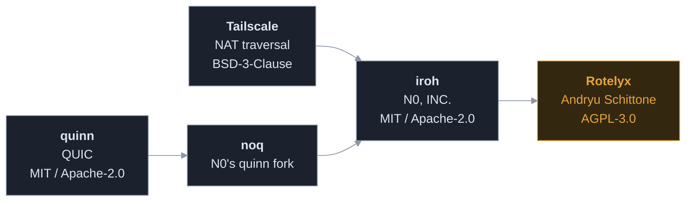

# Provenance and licences

Rotelyx's transport is **derived from [iroh](https://github.com/n0-computer/iroh)**
and vendored into this repository. No upstream networking package is downloaded.

The lineage is worth stating plainly:

**Nobody in this lineage wrote NAT traversal from zero.** Tailscale did the
original work, N0 derived from it, Rotelyx derives from that. Building on it is
the normal case, not the exception.

### The defensible claim

> Rotelyx ships its own transport, derived from iroh and substantially rewritten
> for metadata resistance.

### The indefensible one

> We wrote a transport library from scratch.

Do not make it. Full provenance, licence obligations and the per subsystem
replacement plan are in
[`crates/rotelyx-net/VENDORING.md`](crates/rotelyx-net/VENDORING.md) and
[`crates/rotelyx-net/NOTICE`](crates/rotelyx-net/NOTICE). Those notices are a
licence obligation and must not be removed.

---

## The obligation that comes with the code

Deriving from somebody else's work means their fixes stop arriving. `cargo
update` will never change a line under `crates/net`, so a hole they close stays
open here until a person reads what they did and ports it.

[`docs/UPSTREAM.md`](UPSTREAM.md) is where that reading is recorded, and
`scripts/watch-upstream` and `scripts/audit-dependencies` run weekly to say when
more of it is due. Both are part of the licence's practical cost, not only its
legal one.
