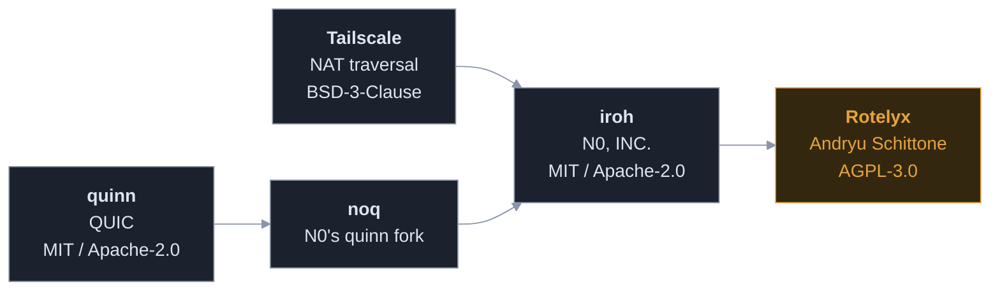

# Provenance and licences

Rotelyx's transport is **derived from [iroh](https://github.com/n0-computer/iroh)**
and vendored into this repository. No upstream networking package is downloaded.

The lineage is worth stating plainly:

**Nobody in this lineage wrote NAT traversal from zero.** Tailscale did the
original work, N0 derived from it, Rotelyx derives from that. Building on it is
the normal case, not the exception.

### The defensible claim

> Rotelyx ships its own transport, derived from iroh and substantially rewritten
> for metadata resistance.

### The indefensible one

> We wrote a transport library from scratch.

Do not make it. Full provenance, licence obligations and the per subsystem
replacement plan are in
[`crates/rotelyx-net/VENDORING.md`](crates/rotelyx-net/VENDORING.md) and
[`crates/rotelyx-net/NOTICE`](crates/rotelyx-net/NOTICE). Those notices are a
licence obligation and must not be removed.

---

## The obligation that comes with the code

Deriving from somebody else's work means their fixes stop arriving. `cargo
update` will never change a line under `crates/net`, so a hole they close stays
open here until a person reads what they did and ports it.

[`docs/UPSTREAM.md`](UPSTREAM.md) is where that reading is recorded, and
`scripts/watch-upstream` and `scripts/audit-dependencies` run weekly to say when
more of it is due. Both are part of the licence's practical cost, not only its
legal one.

---

## Speech, and the corpus question

### What ships today: nothing

The clips the codec is measured on live in `crates/rotelyx-codec/tests/speech/`
and **are not in this repository**. They are 2.3 MB of regenerable binary,
`.gitignore` excludes them, `scripts/make-speech` rebuilds them, and every
measurement that wants them skips itself when they are absent. A fresh clone
builds and passes without them.

They are also **not recordings of people**. That script synthesises them with a
neural text to speech model and says so at the top: nothing in them has been
near a microphone or a room. They are a model's idea of a voice.

Both facts are honest and both have a cost. Measurements taken on synthesised
speech say nothing about how the codec treats a person, and a measurement that
skips itself on a clean checkout is documentation rather than a gate. The
whitening constant in `rotelyx_audio::align` is pinned by exactly such a test.

### What a corpus would be for

Two open items need one, and it is the same corpus for both:

- **A trained vector quantiser for the envelope**, which is the largest bitrate
  saving left in the codec. Codec 2 700C spends 18 bits where Telyx spends about
  100. It ships a codebook, and a codebook is derived from what it was trained
  on.
- **Turning the acoustic measurements into gates**, which needs audio that can
  sit in the repository.

### The licence, checked rather than assumed

A codebook is statistical parameters and is very probably not a derivative work
in the copyright sense at all. That argument is not worth relying on when
corpora exist whose terms make the question moot.

| Corpus | Licence | Fit |
|---|---|---|
| **Mozilla Common Voice** | CC0 | Public domain. No attribution obligation, commercial use and redistribution unrestricted, and multilingual |
| LibriSpeech, LibriTTS | CC BY 4.0 | Permits commercial use and derivatives, and **carries an attribution obligation into every binary that ships the codebook** |
| VCTK | CC BY 4.0 | As above |
| TIMIT | LDC, paid | Not usable here |

**Common Voice is the one to use.** CC0 is the only row with no obligation to
carry, it is the only multilingual row, and that second point is not a
convenience: an envelope codebook trained only on English is a codebook tuned
against every other language this is meant to carry.

CC BY would also work and is a real fallback. It costs an attribution notice
inside the mobile applications, which is an obligation somebody has to remember
at every release rather than once.

**This settles the licence and nothing else.** Whether a trained quantiser
actually saves what Codec 2 suggests it should is a measurement that has not
been made, and the corpus being usable is what allows it to be attempted.

Sources: [Common Voice](https://en.wikipedia.org/wiki/Common_Voice),
[Mozilla Foundation](https://www.mozillafoundation.org/en/blog/common-voice-18-dataset-release/),
[LibriTTS](https://www.isca-archive.org/interspeech_2019/zen19_interspeech.pdf),
[open-access corpus licences](https://waywithwords.net/blog/licences-to-open-access-speech-corpora).
